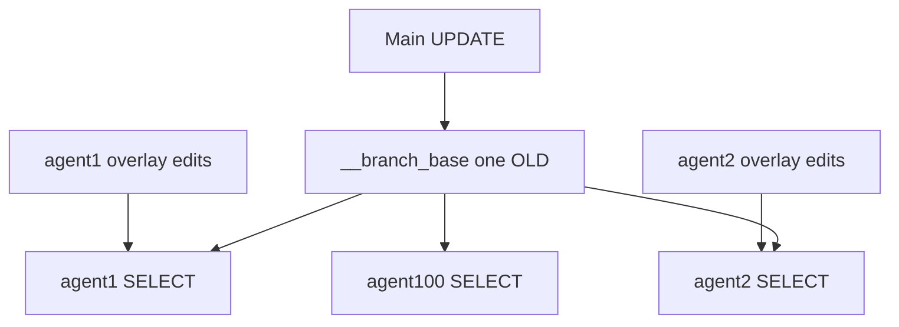
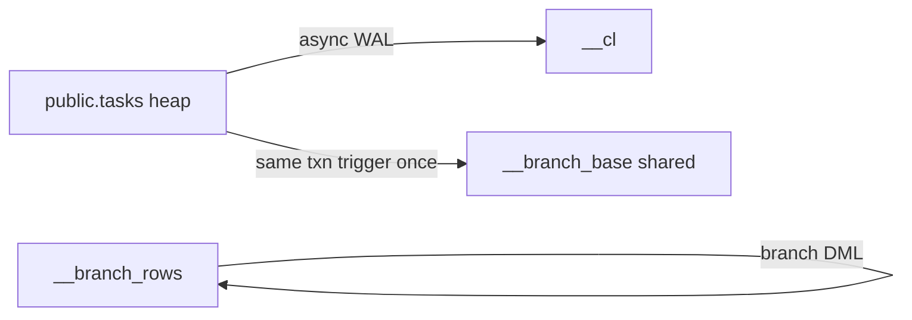
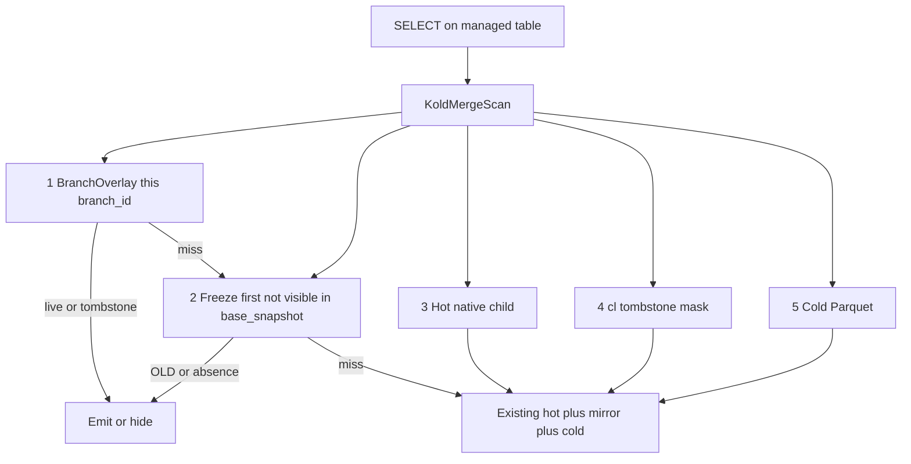
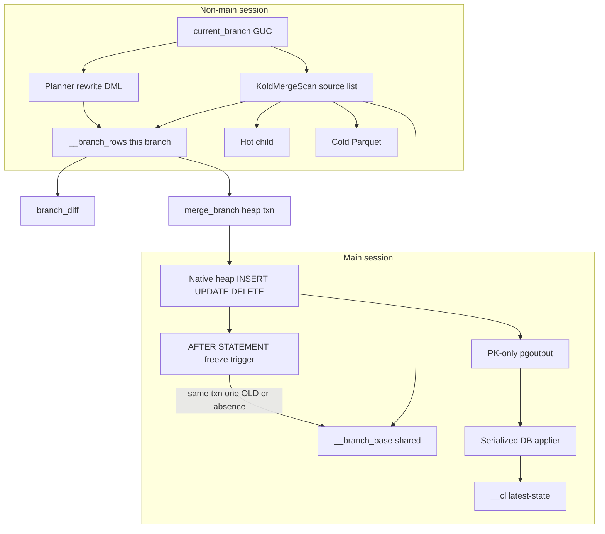
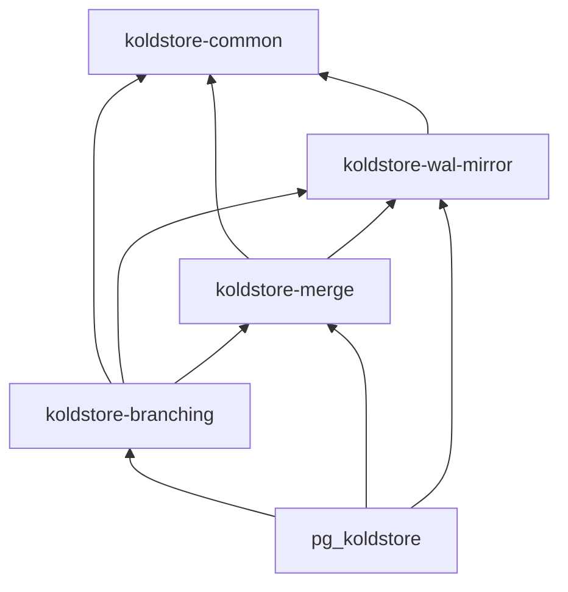

# Durable Copy-on-Write Data Branches

**Goal:** Isolated DML workspaces over one frozen committed view of every KoldStore-managed table in a database: create → edit with ordinary SQL → `branch_diff` / `changes_since` → atomic merge or discard, without cloning tables or turning `__cl` into an audit log.

**Starting point:** Issue [#91](https://github.com/kalamdb/koldstore/issues/91) is the product spec. The protocol probe [`tests/e2e/dml/pgoutput_old_row_cow.rs`](tests/e2e/dml/pgoutput_old_row_cow.rs) already exists. Production capture is still PK-only, ignores `Update.old`, and has no branch catalog. There is no DML rewrite hook today — only `ExecutorEnd`, `ProcessUtility`, and `set_rel_pathlist`.

---

## What the issue got right (keep)

- Database-scoped branches, not schema branches or physical clones.
- One overlay row per `(branch_id, PK)`; no append-only branch audit in v1.
- `__cl` stays latest-state main feed; branch DML must never write it.
- Lazy freeze of BASE: while any branch is open, a **same-transaction** heap trigger writes OLD/absence **once** into shared `__branch_base`. Cost is O(main mutations), not O(branches × mutations). `__branch_rows` is only that agent’s edits. `__cl` stays async WAL.
- `base_seq` is the public snapshot coordinate; `applied_lsn` is internal fencing.
- Flush/prune postponed while any branch is `active`/`merging` (also sidesteps [#122](https://github.com/kalamdb/koldstore/issues/122) for *future* flushes).
- Freeze GC on closer: drop `__branch_base` rows no remaining open branch needs; `TRUNCATE` when the last pin drops.
- Merge is one atomic three-way `fail_on_conflict` transaction; `main_wins` / `branch_wins` stay out of v1 despite the issue’s SQL examples.
- Fail-closed unmanaged DML while `current_branch <> main`.

---

## Design corrections (do not implement the issue verbatim)

Independent reviews (GPT + Claude) plus a second pass against this repo and PostgreSQL 15 docs. Status of each correction:

- **Keep:** 1 (SET TABLE bug), 2 (split enable/fork), 5 (planner rewrite for *branch* DML), 6 (no cold data in v1).
- **Changed:** freeze is a **same-transaction shared log**, not WAL and not per-branch overlay copies (see §3–5). v1 does **not** set `REPLICA IDENTITY FULL` or expand the publication. BASE lookup is `pg_visible_in_snapshot`, not `created_xid > fork_xid`. Freeze GC is required (see §5).
- **v1 table set:** `__cl` + `__branch_rows` (edits) + `__branch_base` (shared freeze). No per-branch seed copies. No `__branch_cl`.

### 1. Fix `SET TABLE` publication membership — confirmed, still required

[`reconcile_publication_columns`](crates/pg_koldstore/src/mirror/lifecycle.rs) runs `ALTER PUBLICATION … SET TABLE {one table} (cols)` on rename. PostgreSQL 15 docs: *“The SET clause will replace the list of tables/schemas in the publication with the specified list.”* That drops every other managed table from `koldstore_async_mirror`. Phase 0: `DROP TABLE t` + `ADD TABLE t` in one transaction.

v1 does **not** set `REPLICA IDENTITY FULL` and does **not** drop/expand column lists for branching. `__cl` stays PK-only pgoutput. The FULL+column-list UPDATE/DELETE error is why we refuse that activation path.

### 2. Split `enable_branching()` from `branch()` — confirmed, but without FULL

Installing freeze triggers and `CREATE __branch_rows` / `__branch_base` assigns an XID. [`require_no_assigned_xid_for_slot_provision`](crates/pg_koldstore/src/mirror/lifecycle.rs) still applies if `branch()` then peeks the slot for `base_seq`.

- `koldstore.enable_branching()`: operator opt-in; create `__branch_rows` + `__branch_base`; install freeze triggers (same pattern as the existing PK guard); drain in-flight flushes; refuse cold segments. **No** `ALTER TABLE … REPLICA IDENTITY FULL`.
- `koldstore.branch(name)`: refuses until `branching_enabled`; arm capture; fence for `base_seq`/`base_lsn`; store `base_snapshot`; insert catalog row. No DDL. No per-branch heap and no copy of main.

Still persist `seq_high_watermark` on every `__cl` write (flush fences currently skip `record_applied_lsn`). Derive `base_seq` inside the apply lock.

### 3. 100 open branches must not copy OLD 100 times

WAL-applied seeds still lose the race (heap commits first). Triggers stay. **Per-branch overlay seeds do not scale:**

| Design | Main `UPDATE` with 100 open branches | Branch `SELECT` |
|---|---|---|
| Seed each overlay | 100 inserts of the same OLD | This overlay only (reads scale) |
| Shared `__branch_base` | **1 insert** | This overlay + 1 freeze probe (reads scale) |

The write axis that matters is **main mutations while any branch is open**, not agent count. Overlay size is **that agent’s edits**, not `main_rows × branches`. `branch(name)` copies nothing.



`__branch_rows` holds **edits only** (no `is_seed` column, no fan-out).

AFTER STATEMENT trigger (PK-guard pattern), same heap transaction:

- `UPDATE`/`DELETE`: insert OLD into `__branch_base` with `created_xid = pg_current_xact_id()`, `prior_cl_seq` from current `__cl` (CDC identity only), `was_present = true`.
- `INSERT`: absence row, `was_present = false`.
- `ON CONFLICT (pk, created_xid) DO NOTHING` (same txn touching the PK twice keeps the first OLD).
- Rollback/savepoint undoes the freeze with the heap write.
- No-op when `active_branch_count = 0`. Skip flush cleanup; do **not** skip `merge_branch` (other branches need that OLD).

Store `created_xid` as an **`xid8` column**. Do not use heap `xmin` for lookup — `VACUUM FREEZE` rewrites `xmin` and would break BASE.

WAL fills `__cl` only.

### 4. BASE lookup is snapshot visibility, not `created_xid > base_xid`

**Do not** resolve BASE as `created_xid > fork_xid`. Xid order is not commit order: a txn that started before fork (lower xid) can commit after fork. That freeze row would be skipped and the branch would fall through to the post-fork heap value.

`prior_cl_seq >= base_seq` is also unsafe as the lookup key: the trigger reads `__cl` under apply lag, so two later mutations can stamp the same stale seq.

**v1 lookup:** fork stores `base_snapshot pg_snapshot` (`pg_current_snapshot()` after capture is armed). `base_seq` / `base_lsn` remain the public CDC coordinates.

For PK `K` on branch B:

```text
first __branch_base row for K
  where NOT pg_visible_in_snapshot(created_xid, B.base_snapshot)
  order by created_xid
```

That OLD/absence is BASE. If none, current `KoldMergeScan` is BASE (main never replaced `K` after this snapshot).

In-flight-at-fork: the writer’s xid is in the snapshot’s in-progress list, so `pg_visible_in_snapshot` is false; after it commits, the freeze is visible now and counts as BASE. Arm capture (`creating`) **before** taking the snapshot so that txn’s trigger actually ran.

Two branches, two snapshots, one freeze log: A sees the first freeze not visible in A’s snapshot; B sees the first not visible in B’s. No copies.

### 5. Verdict: this design is the right complexity, and it scales — if we GC

**Good, not overbuilt.** The extra moving part versus “copy OLD into every overlay” is one shared heap plus a snapshot probe. That replaces an `O(branches)` write tax with an `O(1)` write. Overlay DML, merge, and `changes_since` stay simple. The snapshot lookup is the only PostgreSQL-hard piece; it is load-bearing (xid inequality is incorrect). Do not add WAL FULL, `__branch_cl`, or per-branch seeds on top.

**Where complexity lives (keep it here):** freeze trigger, `base_snapshot`, freeze GC, ordered merge-scan **source list**, three branch-only HotChild/native gates. Do not extend OrderedProgressive in v1. Do not add a second custom scan.

**Scale (100 branches):**

| Axis | Cost |
|---|---|
| `branch(name)` | Catalog row. No copy. |
| Main DML | One `__branch_base` insert per mutated PK, independent of 100. |
| Branch `SELECT` | This overlay + one freeze probe + existing scan. Other agents are not opened. |
| Overlay storage | That agent’s edits only. |
| Freeze storage | Main mutations **while any branch is open**, not `rows × branches`. |

The freeze table is the pin. A forgotten long-lived branch plus heavy main DML will grow `__branch_base` until that branch is gone. That is why GC and `expires_at` are required, not optional. 100 well-behaved short branches are cheap. One abandoned branch is the operational risk.

**Do not simplify** by taking `AccessExclusiveLock` on every managed table at fork just to use `seq`/`xid` inequality. Worse UX, still need a freeze log.

### 6. Yes — clean `__branch_base` when no open branch still needs the row

A freeze row is a preimage for branches that forked **before** that mutation committed. Once every such branch is `merged`, `discarded`, or expired, the row is garbage.

**Need predicate (exact, not “oldest snapshot”):** branch B still needs freeze row F iff `NOT pg_visible_in_snapshot(F.created_xid, B.base_snapshot)` and B is `creating` / `active` / `merging`. Concurrent forks can have incomparable in-progress sets, so “visible in the oldest snapshot” is **not** a proof.

```sql
-- per managed table, after a closer (not on every main DML)
DELETE FROM koldstore.<t>__branch_base f
WHERE NOT EXISTS (
  SELECT 1 FROM koldstore.branches b
  WHERE b.status IN ('creating', 'active', 'merging')
    AND NOT pg_visible_in_snapshot(f.created_xid, b.base_snapshot)
);
```

**When to run**

- **Last closer** (`active_branch_count` drops to 0 after merge, discard, expiry, or `disable_branching`): `TRUNCATE __branch_base` on every managed table. Fast path. Freeze trigger already no-ops at count 0, so new inserts stop.
- **Some branches remain:** run the `DELETE` above. Same closer paths: successful `merge_branch`, `discard_branch`, expiry worker. Async job (do not add a freeze-table scan to the user’s merge/discard transaction beyond the catalog update). Overlay cleanup stays `DELETE FROM __branch_rows WHERE branch_id = $1`.
- **Never** on the main DML freeze trigger. That would tax the write path we just made `O(1)`.

`merged` / `discarded` catalog rows are retained for status but **do not** pin freeze. Only `creating` / `active` / `merging` pin.

Optional safety: if `__branch_base` exceeds a size/row quota while branches exist, enqueue the same GC job and/or error new forks until expiry catches up. Status JSON should expose freeze-row counts.

### 7. Two different “trigger” questions — do not mix them

- **Main → shared freeze log:** heap triggers into `__branch_base`. Correct (§3).
- **Branch session DML on managed tables:** still a **planner rewrite**, not BEFORE triggers. Heap BEFORE triggers evaluate `WHERE` against main, miss overlay-only rows, and break `RETURNING`. `ExecutorStart` is only a fail-closed guard.

Supported branch DML forms first; reject with a specific error: `MERGE`, `COPY`, `WHERE CURRENT OF`, `FROM`-list UPDATE, `FOR UPDATE/SHARE`, system-column `RETURNING`, PK/segment-order mutation, user triggers/FKs/exclusion constraints.

### 8. Already-cold data is a hard v1 gate — keep

Flush postpone does **not** rehydrate existing Parquet. Native merge DML and uniqueness are still hot-only ([#122](https://github.com/kalamdb/koldstore/issues/122)).

**v1:** `enable_branching()` / `branch()` refuse if any managed table has cold segments. Combined with postpone, every merge target stays on the heap. Revisit after #122.

### 9. Decode/apply byte budget — optional now

v1 does not put full rows through pgoutput. Keep PK-only apply. Byte-budgeted peek and `UnchangedToast` handling remain useful hardening but are **not** on the seed path. The existing [`pgoutput_old_row_cow.rs`](tests/e2e/dml/pgoutput_old_row_cow.rs) probe stays as a fallback experiment if triggers ever prove too expensive.

---

## Per-managed-table artifacts (end state)

Example `public.tasks` when branching is enabled:

- `koldstore.public_tasks__cl` — main change-log (unchanged)
- `koldstore.public_tasks__branch_rows` — **this branch’s edits only**
- `koldstore.public_tasks__branch_base` — **shared** freeze log (one OLD/absence per main mutation, not per branch)

No `__branch_cl`. `unmanage_table` drops all three plus the PK guard and freeze trigger.



### When created

- **`manage_table` today:** `__cl` + indexes + PK guard + PK-only publication.
- **`manage_table` while `branching_enabled`:** plus empty `__branch_rows` and `__branch_base` + freeze trigger.
- **`enable_branching()`:** create both heaps if missing; install trigger. No row copy. No replica-identity change.
- **`branch(name)`:** catalog only (`base_seq`, `base_lsn`, `base_snapshot`). No per-branch copy of main.

### 1. `__cl` — unchanged

Same DDL as today. WAL applier only. Main `changes_since`.

### 2. `__branch_rows` — edits only

```sql
CREATE TABLE koldstore.<schema>_<table>__branch_rows (
    "branch_id"       uuid NOT NULL,
    <application columns>,
    "op"              smallint NOT NULL,  -- 1/2/3; 3 = branch tombstone
    "seq"             bigint NOT NULL,    -- per-branch PRE_COMMIT seq
    "schema_version"  integer NOT NULL,
    "created_at"      timestamptz NOT NULL,
    "updated_at"      timestamptz NOT NULL,
    PRIMARY KEY ("branch_id", <source pk>)
);
CREATE INDEX ON koldstore.<schema>_<table>__branch_rows ("branch_id", "seq");
```

Writer: branch DML only. 100 other branches do not appear in this query (`WHERE branch_id = $1`).

### 3. `__branch_base` — shared freeze (the 100-branch answer)

```sql
CREATE TABLE koldstore.<schema>_<table>__branch_base (
    <pk columns>           NOT NULL,
    "created_xid"          xid8 NOT NULL,   -- pg_current_xact_id() in the trigger
    "prior_cl_seq"         bigint NOT NULL, -- seq already published on main
    "was_present"          boolean NOT NULL,
    "schema_version"       integer NOT NULL,
    <application columns, nullable when was_present = false>,
    PRIMARY KEY (<pk columns>, "created_xid")
);
CREATE INDEX ON koldstore.<schema>_<table>__branch_base ("created_xid");
```

One insert per main statement that changes a PK, regardless of branch count. `prior_cl_seq` is the seq a main subscriber already has for that PK.

### Query path — one KoldMergeScan, ordered source list (not a second scanner)

Do **not** store branch rows in Parquet or the cold catalog. Cold is published main history; `__branch_rows` is a heap that must take ordinary DML in the same snapshot. The thing in common is the **PK-keyed winner**, which [`KoldMergeScan`](docs/architecture/scanning-table.md) already is: hot heap + `__cl` tombstone mask + cold Parquet ([`NewestFirstWinnerResolver`](crates/koldstore-merge/src/core/resolver.rs), [`MirrorOverlay`](crates/koldstore-merge/src/core/overlay.rs), [`execute.rs`](crates/pg_koldstore/src/merge_scan/pg/execute.rs)).

User-facing fallback when `current_branch` is `agent-42`:

```text
branch overlay  →  freeze BASE  →  hot heap  →  cold Parquet
                   (__cl tombstones already mask cold, unchanged)
```

That is the same custom scan node, extra **front layers**, then today’s MainComposite. Reads never loop over other branches (`__branch_rows WHERE branch_id = $current` only).



**What is shared vs what is not**

- Cold / `__cl` stay Parquet + mirror heap. Branch stays `__branch_rows` / `__branch_base` heaps. Do not unify storage.
- Winner protocol to reuse: `NewestFirstWinnerResolver` is **first-seen PK**, not a seq compare across unrelated timelines. Feed overlay, then freeze, then today’s hot, then today’s cold. Do not clone [`execute.rs`](crates/pg_koldstore/src/merge_scan/pg/execute.rs). Do not add `KoldBranchScan`.

Freeze is not another cold segment. On the main timeline it is older than current heap; on the branch view it must win over hot — which is exactly “supply it before hot so `seen` already contains the PK.”

### Current KoldMergeScan — we can extend it without a rewrite

Verified against the code (not the docs-only story).

**Control flow today**

1. Planner [`set_rel_pathlist`](crates/pg_koldstore/src/merge_scan/pg.rs): unmanaged / not SELECT → native. **`segment_count == 0` → return (no CustomScan).** `cold_side_proven_empty` → return. Else install the KoldMergeScan portfolio.
2. [`begin_custom_scan`](crates/pg_koldstore/src/merge_scan/pg.rs): exact-PK uninstrumented → `HotProbeState::Pending` (first `ExecProcNode` on the native child; **no overlay, no Parquet**). Runtime cold-empty + delegate-safe → `Delegate` (pure child). Else `initialize_fallback_scan`.
3. [`execute_scan_sources_with_profile`](crates/pg_koldstore/src/merge_scan/pg/execute.rs): `probe_hot_point_hit` (SPI, before Parquet). If no cold + child exists → `EmitPath::HotChild`. Else `MergeRowStream`.
4. [`MergeRowStream::next_materialized`](crates/pg_koldstore/src/merge_scan/pg/execute.rs): exhaust **hot** pages via `resolve_hot_batch` (PKs enter `seen`); then `__cl` `mask_older_pks`; then **cold** pages via `resolve_cold_batch` (skips `seen`). `MirrorOverlay` only masks cold.

`ScanEmitMode`: `HotChild` | `Buffer` | `Stream`. `EmitPath`: `HotChild`, `HotNative`, `ColdNative`, `MergeStream`, `OrderedMergeNative`, `UnorderedHotFirst`.

**The seam that already matches branching**

[`take_unseen_ordered`](crates/koldstore-merge/src/core/resolver.rs) drops a PK if it is already in `seen`, including deleted/tombstone identities. Hot-then-cold is “higher priority source first.” Overlay and freeze are the same shape (`HotRow` live or `deleted`). `__cl` stays a **mask on cold only**, not a source.

### Suggested merge-scan design: ordered source list (not a phase enum)

After reading `MergeRowStream`, I do **not** recommend a different winner or a second CustomScan. I **do** recommend not bolting `Overlay`/`Freeze` as copy-pasted arms next to `hot_phase_done`.

Today the stream is a hardcoded pair of fields:

```text
struct MergeRowStream { hot: HotMergeSource, cold: ColdRowStream, overlay: MirrorOverlay, hot_phase_done, ... }
```

That is why adding branch looks like a fork. Make the **Stream path** (not HotChild) a list drained in priority order. Same loop for both products:

```text
main:    [ Hot, Cold+__cl mask ]
branch:  [ Overlay, Freeze, Hot, Cold+__cl mask ]
```

```text
loop:
  emit queued winners from the current source
  if that source is exhausted → advance
  load one batch → resolve_hot_batch / resolve_cold_batch (first-seen PK)
  cold batches run retain_unmasked(__cl) first, as today
```

`HotMergeSource` already abstracts SPI vs native child. Overlay and freeze are additional SPI sources (SQL from `koldstore-branching`), not new emit modes. Cold stays `ColdRowStream`; `__cl` stays attached to **that** source as a mask.

**HotChild stays a bypass, not a source.** `EmitPath::HotChild` / `Pending` / `Delegate` never enter `MergeRowStream`. They remain valid iff the logical list would be `[Hot]` only: session is `main` and cold cannot contribute. A branch session always has Overlay/Freeze in the list, so it always uses Stream (or Exact PK probes) even when the cold manifest is empty.

**Build the list in one place** (`execute_scan_sources` / `prepare_merged_stream`):

1. If `current_branch <> main`: push Overlay, push Freeze.
2. Push Hot (`HotMergeSource::NativeChild` or `SpiJson`, same as today).
3. If cold stream present: push Cold with `MirrorOverlay`.

No `if branch { overlay_phase } else { hot_phase }` in `next_materialized`.

**Refactor order (so main does not regress)**

1. Change `MergeRowStream` internals to `Vec<LogicalSource>` with **two** entries (hot, cold). Existing merge-scan tests must stay green. Do not change `begin_custom_scan` HotChild.
2. Attach Overlay/Freeze when the session is a branch. Add the three gates below.
3. Leave `OrderedProgressive` on the **two-source** (hot, cold) constructor only. Branch v1 does not call it.

**v1 branch portfolio:** `ExactPrimaryKey` + `UnorderedHotFirst` + `GeneralMerge`. PostgreSQL `Sort` for `ORDER BY`. Revisit ordered-progressive-on-branch only after the source list is proven on unordered/exact-PK.

**Three branch-only gates (do not touch these on main)**

| Gate | File | Branch session | Main session |
|---|---|---|---|
| Empty manifest native return | `set_rel_pathlist` ~417 | Skip; always install KoldMergeScan | Unchanged |
| `HotProbeState::Pending` / `Delegate` | `begin_custom_scan` ~666–701 | Skip; go to fallback | Unchanged |
| `cold_stream None` → `HotChild` | `execute.rs` ~683–687 | Skip; Stream with `[Overlay, Freeze, Hot]` | Unchanged |

Exact PK: probe overlay SPI, then freeze SPI, then existing `probe_hot_point_hit`. A heap child hit must not win if overlay/freeze has that PK.

**What I am not suggesting**

- A new CustomScan name, Parquet for branches, or treating freeze as another cold segment.
- A new `RowSource` / priority-overlay trait in `koldstore-merge`.
- Running overlay on HotChild.
- Teaching OrderedProgressive N frontiers in v1.
- Making `koldstore-merge` depend on branching.

**Honest complexity**

- **Right amount:** one `Vec` drain loop, two SPI loaders next to [`mirror.rs`](crates/pg_koldstore/src/merge_scan/pg/mirror.rs), three `if branch` gates, EXPLAIN counters per source.
- **Too much:** `MergePhase` with four copy-pasted `next_materialized` arms; OrderedProgressive-on-branch in the first cut.
- **Must not regress:** empty-manifest native plans and `EmitPath::HotChild` when the session is `main`, even if other sessions have branches open ([AGENTS.md](AGENTS.md)).

**Crate split:** `koldstore-merge` stays free of branch catalog types. `koldstore-branching` plans overlay/freeze SQL. [`merge_scan`](crates/pg_koldstore/src/merge_scan) owns the source list. `LogicalSource` lives next to `HotMergeSource` in the adapter (PostgreSQL streams), not as branch types in the merge crate.

v1 still postpones flush / refuses existing cold, so Cold may be absent from the list while branches are open. The same Stream path still accepts Cold later ([#122](https://github.com/kalamdb/koldstore/issues/122)) without a second merge.

Overlay discard: `DELETE FROM __branch_rows WHERE branch_id = $1`. Freeze GC is §6: `TRUNCATE` when the last pin drops, else `DELETE` rows no remaining `creating`/`active`/`merging` snapshot still needs. Do not use “oldest snapshot” as the need test.

### Database catalog

`koldstore.branches`: `base_snapshot pg_snapshot` (lookup), `base_seq` / `base_lsn` (public CDC). Extend `async_mirror_state` with branching flags. Schema catalog stores OIDs of `__cl`, `__branch_rows`, `__branch_base`.

---

## Architecture



**Session:** `koldstore.current_branch` Userset GUC (default `main`) plus `set_current_branch` / `current_branch()`. `check_hook` validates syntax only (no catalog). `assign_hook` calls `ResetPlanCache()`. Resolve name → `branch_id` + status at statement start.

**Main fast path:** if no open branches, freeze trigger returns immediately; heap DML and `__cl` apply unchanged (PK-only WAL). Freeze I/O only when `active_branch_count > 0`. Overlay I/O only for a non-main session (and only that `branch_id`).

**Branch SELECT — ordered sources inside KoldMergeScan:**

1. Overlay (`__branch_rows` for this `branch_id`).
2. Freeze (`__branch_base`, first not visible in fork snapshot).
3. Hot native child.
4. Cold Parquet, with `__cl` tombstone mask on that source only.

Main session list is `[Hot, Cold+mask]` or HotChild when cold cannot contribute.

Name both branch heaps like `__cl` (hashed, OID in catalog). Reuse `bounded_identifier`; do not copy the hash.

---

## Crate and folder layout (maintainable split)

Follow [crate-architecture.md](docs/architecture/crate-architecture.md): `pgrx` stays in `pg_koldstore`; domain logic in the lowest PostgreSQL-free layer. **Do not** put branch catalog/FSM/SQL in `koldstore-merge`. Do **not** add a new winner type; feed overlay/freeze into `NewestFirstWinnerResolver` first. Do not put branch types in `koldstore-catalog`.

### New library: `crates/koldstore-branching`

PostgreSQL-free. Workspace member + `workspace.dependencies` entry, same as merge/mirror. Depends on `koldstore-common` and `koldstore-wal-mirror` (reuse, not reimplement). May depend on `koldstore-merge` for cursor/PK helpers. **`koldstore-merge` must not depend on `koldstore-branching`** (no cycle). Flush/migrate stay unaware; the adapter calls them.

```text
crates/koldstore-branching/src/
  lib.rs              //! crate contract + re-exports
  catalog.rs          branch row types, status FSM, ACL predicates
  overlay.rs          plan __branch_rows DDL, branch UPSERT SQL
  freeze.rs           plan __branch_base DDL + AFTER STATEMENT freeze trigger SQL
  gc.rs               overlay-delete-by-branch + freeze need-predicate (TRUNCATE vs DELETE)
  resolve.rs          source-list order: overlay, freeze, hot, cold
  scan.rs             build the KoldMergeScan source list; no second custom scan
  diff.rs             net overlay vs BASE classification
  merge.rs            fail_on_conflict three-way rules (no SQL execution)
  dml.rs              which INSERT/UPDATE/DELETE forms are supported
  changes.rs          overlay changes_since cursor plan (delegates to merge changelog)
  flush_gate.rs       postpone/admission predicates
```

Every file starts with `//!`. Public functions document purpose, invariants, and `# Errors`.

### Thin adapter: `crates/pg_koldstore/src/branching/`

All extension branching code lives here. Other `pg_koldstore` modules get **one-line call sites**, not branch logic.

```text
crates/pg_koldstore/src/branching/
  mod.rs              //! adapter docs; pub(crate) modules
  sql.rs              #[pg_extern] wrappers (SQL contract in rustdoc)
  session.rs          resolve GUC → branch_id/status per statement
  guc.rs              current_branch GUC; assign_hook ResetPlanCache
  catalog.rs          SPI for koldstore.branches
  hooks.rs            ExecutorStart guard + planner rewrite + utility rejects
  freeze.rs           execute freeze-trigger DDL (SPI); skip path for flush cleanup
  gc.rs               run overlay delete + freeze TRUNCATE/DELETE after closers
  scan.rs             build source list when branch <> main; HotChild forbidden
  flush.rs            admission called from sql/flush
  events.rs           changes_since(branch) dispatch
```

`lib.rs` adds `pub mod branching;`. Hook registration stays in [`hooks/mod.rs`](crates/pg_koldstore/src/hooks/mod.rs) as `branching::register_hooks()`. GUC `define_gucs()` calls `branching::guc::define()`. Do not scatter branch SQL under `sql/` or new files next to `mirror/apply.rs`.

### What stays in existing crates (minimal patches only)

These are capture/flush/scan infrastructure, not branch product code:

- [`koldstore-wal-mirror`](crates/koldstore-wal-mirror): export `bounded_identifier`; SET TABLE membership fix. Overlay/freeze SQL lives in `koldstore-branching` and **calls** `MirrorColumn`, `SqlStatement`, `quote_ident`, mirroring [`plan_mirror_pk_guard`](crates/koldstore-wal-mirror/src/mirror/guard.rs).
- [`pg_koldstore/src/mirror/apply.rs`](crates/pg_koldstore/src/mirror/apply.rs): persist seq watermark only. Do **not** write `__branch_base` from WAL.
- Freeze trigger install next to PK guard in manage/enable_branching.
- [`pg_koldstore/src/merge_scan`](crates/pg_koldstore/src/merge_scan): main/unset `current_branch` unchanged, including `EmitPath::HotChild` and empty-manifest native paths. Branch session: always `KoldMergeScan`, attach overlay+freeze layers, never `HotChild`. One-line call into `branching::scan`. Do not clone `execute.rs`.
- [`koldstore-setup`](crates/koldstore-setup): add `koldstore.branches` to `REQUIRED_CATALOG_TABLES`; DDL still in [`koldstore--0.1.0.sql`](crates/pg_koldstore/sql/koldstore--0.1.0.sql).
- [`koldstore-merge`](crates/koldstore-merge): no branch catalog types and no new overlay trait in v1. Reuse `NewestFirstWinnerResolver` (first-seen PK), `MirrorOverlay`, `changes_since` / `ChangeCursor`, `SimplePkPredicate`. Overlay/freeze are extra sources on the adapter list. Do not fold freeze SQL into this crate.



---

## Reuse existing helpers — do not duplicate

If a planner, namer, fence, cursor, or GUC pattern already exists, call it. New code is the branch FSM, overlay+freeze plans, BASE/three-way rules, generic merge-layer types, and the adapter.

- **Naming / SQL AST:** `quote_ident`, `quote_qualified_ident`, `SqlStatement`, `MirrorColumn`, `PrimaryKeyShape`, `mirror_relation_for_source`, export `bounded_identifier` for `__branch_rows` and `__branch_base` suffixes. Do not copy the FNV hash or invent a second identifier scheme.
- **Overlay / freeze DDL:** follow `plan_mirror_schema_with_order_key` — `plan_overlay_schema` and `plan_freeze_schema` in `koldstore-branching`. Do not clone `__cl` (overlay is per-branch edits; freeze is shared versioned OLD).
- **WAL fence / seq:** `wait_for_async_mirror`, `capture_durable_wal_fence`, `BoundedApplyRequest`, `next_id_after`. Fork and merge catch-up call these; do not write a second peeker.
- **Decode:** production apply still ignores `Update.old`. Freeze does not use pgoutput. Keep the existing FULL probe as an optional fallback only.
- **PK extract:** `pk_identity`, `primary_key_cells`, `PkBindColumn` from apply_row for overlay/freeze binds.
- **DML form detection:** `simple_pk_delete_supported`, `extract_simple_pk_delete_predicate`, `plan_managed_*_effect` in `koldstore-merge`. Branch rewrite uses these to accept/reject statements.
- **Merge scan:** generalize `MergeRowStream` to an ordered source list (main `[hot, cold]`, branch `[overlay, freeze, hot, cold]`). Reuse `NewestFirstWinnerResolver`, `HotMergeSource`, `mirror.rs`. Do not clone `execute.rs`, do not add `KoldBranchScan`, do not put branch rows in Parquet, do not extend `OrderedProgressive` in v1. Do not change `EmitPath::HotChild` on main.
- **Change feed:** `koldstore-merge` `changes_since` / `ChangeCursor` / `plan_mirror_changes_since`. Main `branch => main` stays [`sql/events/mod.rs`](crates/pg_koldstore/src/sql/events/mod.rs). Overlay feed reuses the exclusive-seq helper, not a new pagination algorithm.
- **GUC / session:** copy the `koldstore.user_id` pattern in [`guc.rs`](crates/pg_koldstore/src/guc.rs) / [`sql/session.rs`](crates/pg_koldstore/src/sql/session.rs). Internal merge writes reuse `internal_system_write`, do not add a user-settable bypass.
- **Catalog / managed OIDs:** [`catalog/cache.rs`](crates/pg_koldstore/src/catalog/cache.rs) `is_managed_relation` for fail-closed unmanaged DML.
- **Locks:** existing apply/lifecycle advisory locks (`lock_slot`, `LIFECYCLE_LOCK_NAMESPACE`). Do not invent a parallel lock namespace without documenting why.
- **Flush gate:** call into existing `enqueue_flush_job_if_due` / `flush_table_pg_impl` with an admission check from `flush_gate.rs`. Do not duplicate the job queue.
- **Status JSON:** extend `table_status` / `async_mirror_status` builders; do not add a third status object model.
- **PK / order guards:** existing BEFORE UPDATE guard. Freeze triggers are a second source-heap trigger family, planned the same way. Do not fold freeze logic into the PK-guard function.

Rule for implementers: before writing a helper, grep the workspace. If it exists, import it. If it is `pub(crate)` in the wrong crate, export it rather than copy it.

---

## Documentation and comments (required in the same change)

Architecture docs must change with this feature ([AGENTS.md](AGENTS.md)). Every new `lib.rs` / module starts with `//!`. `#[pg_extern]` wrappers document the SQL contract and the library function they delegate to.

New: [`docs/architecture/data-branches.md`](docs/architecture/data-branches.md) — product semantics, activation vs fork, why freeze is shared, KoldMergeScan ordered source list (not Parquet for branches, not a second custom scan), snapshot BASE resolution, freeze GC, DML rewrite, flush postpone, merge locking, `changes_since`, crate map.

Update in the same PRs that change the contract:

- [`docs/architecture/crate-architecture.md`](docs/architecture/crate-architecture.md) — add `koldstore-branching`; “Where New Code Goes”: overlay/freeze SQL in `koldstore-branching`, merge executor phases in `pg_koldstore::merge_scan`.
- [`docs/architecture/dml-table.md`](docs/architecture/dml-table.md), [`mirror-capture.md`](docs/architecture/mirror-capture.md), [`flushing-table.md`](docs/architecture/flushing-table.md), [`scanning-table.md`](docs/architecture/scanning-table.md), [`manage-table.md`](docs/architecture/manage-table.md)
- [`docs/sql-api.md`](docs/sql-api.md) — branching SQL + `changes_since(..., branch)`
- [`docs/limitations.md`](docs/limitations.md) — freeze-trigger cost while branches are open (O(main DML), not O(branches)); freeze storage is pinned until every needing branch is merged/discarded/expired; no cold-data branching until #122; unsupported DML forms; sequence/`nextval` leak

Do not add architecture-doc churn for purely internal refactors. Comments explain invariants (`capture armed before base_snapshot`, `SET TABLE replaces publication membership`, `freeze INSERT ON CONFLICT DO NOTHING`, `VACUUM FREEZE must not be used as lookup xmin`, `overlay has no is_seed copies`, `merged/discarded do not pin freeze`), not what the next line does.

---

## `changes_since` and branches

Today: table-scoped exclusive `seq` cursor over `__cl` + cold Parquet; seq allocated by the one DB applier. Latest-state, not a full event log. [`docs/sql-api.md`](docs/sql-api.md), [`crates/pg_koldstore/src/sql/events/mod.rs`](crates/pg_koldstore/src/sql/events/mod.rs).

**Invariants**

- Overlay writes never touch `__cl` or `seq_high_watermark`. Production CDC stays linear main history while branches are open.
- Merge writes ordinary main heap DML; the applier then emits **per-PK** main feed events (not one “merge” event).
- Main and branch cursors are **not** interchangeable.

**API**

```sql
koldstore.changes_since(
  table_name, since_seq, limit_rows, last_rows,
  branch => text  -- default current_branch()
)
```

| `branch` | Behavior |
|---|---|
| `main` | Existing `__cl` + cold cursor. Unchanged. Call this from a branch session to read production CDC. |
| other | Overlay cursor for that branch+table (edits only). `source = 'branch'`. `row_image` from overlay. No cold. Freeze rows are not branch-feed events. |

If the session is non-main and `branch` is omitted, use the session branch — do **not** silently return main (agent footgun).

**Branch seq (commit-ordered):** do not stamp seq at DML time (T1=5, T2=6, T2 commits first → consumer advances past 6 and misses 5). At `PRE_COMMIT`, take the branch-row lock, allocate `branch_seq`, stamp overlay rows written in this xid. Per-branch seq space for real edits only.

Freeze rows may still carry **prior `__cl.seq`** so a client that already synced main sees the same seq on the frozen image when reconstructing BASE. They are not overlay events.

`branch_diff` is the net BASE vs SOURCE review API (overlay PKs only). `changes_since` on a branch is incremental overlay catch-up of real edits only.

E2E must prove: branch DML absent from main feed; main DML still visible while branches exist; after merge, expected PKs appear with new main seqs; overlay `changes_since` sees branch writes in commit order and does not mix with main seqs; 100 concurrent branches share freeze rows (one `__branch_base` insert per main UPDATE, not 100).

---

## Public SQL (v1)

Lifecycle: `enable_branching()`, `disable_branching()`, `branch(name)`, `list_branches()`, `branch_status(name)`, `set_current_branch`, `current_branch()`, `discard_branch(name)`.

Review: `branch_diff`, `branch_conflicts`, `can_merge`.

Merge: `merge_branch(name)` only (`conflict_policy` omitted or must be `fail_on_conflict`). Reject `main_wins` / `branch_wins`.

GUC: `SET koldstore.current_branch = 'test1'`. `main` reserved.

ACL v1: creator + superuser / table owner for switch+write+diff; merge requires table ownership on every managed table (stronger). Document as preview; full grants later ([#120](https://github.com/kalamdb/koldstore/issues/120)).

---

## Implementation phases

Scaffold `koldstore-branching` + `pg_koldstore/src/branching/` first. Prototype **planner DML rewrite** and **same-transaction shared freeze triggers** before overlay GC or merge polish. Those two decide whether the feature is buildable. New logic goes in the branching crate; existing crates only get reuse exports and one-line call sites.

### Phase 0 — Prerequisites (fail fast)

- Fix `reconcile_publication_columns` (`DROP`+`ADD` or full-member `SET TABLE`).
- Persist seq watermark on every `__cl` write, independent of `applied_lsn` ack.
- Optional: keep [`pgoutput_old_row_cow.rs`](tests/e2e/dml/pgoutput_old_row_cow.rs) as a WAL-OLD fallback probe. Not on the v1 seed path.

### Phase 0.5 — Crate scaffold (before feature logic)

- Add `crates/koldstore-branching` with `//!` crate docs, empty modules listed above, unit tests that compile.
- Add `pg_koldstore/src/branching/mod.rs` and wire `pub mod branching` + workspace deps.
- Update crate-architecture.md in that same change so later phases have a documented home.

### Phase 1 — Catalog, GUC, activation, status

- `koldstore.branches` in [`koldstore--0.1.0.sql`](crates/pg_koldstore/sql/koldstore--0.1.0.sql) (beta: edit install SQL, no upgrade edge) and `REQUIRED_CATALOG_TABLES`.
- Types/FSM in `koldstore-branching::catalog`; SPI in `pg_koldstore::branching::catalog`.
- Database flags: `branching_enabled`, `active_branch_count`, `oldest_branch_base_seq`, `flush_postponed_by_branches`.
- `enable_branching()`: drain in-flight flush jobs, refuse cold segments, `CREATE __branch_rows` and `__branch_base`, install freeze triggers (PK-guard pattern), mark enabled. Do **not** set `REPLICA IDENTITY FULL` or change publication column lists.
- Status: extend existing `table_status` / `async_mirror_status`.
- Reject `manage_table` / `unmanage_table` / rewriting DDL / `SET UNLOGGED` / replica-identity changes while any branch is `active`/`merging`. Newly managed tables must be made branch-capable before manage completes if branching is already enabled.

### Phase 2 — Fail-closed sandbox

- `ExecutorStart`: unmanaged mutating `ModifyTable` errors when branch ≠ main (ExecutorEnd is too late).
- `ProcessUtility`: `COPY`, `TRUNCATE`, `REFRESH MATERIALIZED VIEW`, CTAS, `CALL` that writes, manage/unmanage.
- Document non-table side effects (`nextval`, large objects). Reject `serial` / identity PK inserts in a branch or treat sequence advance as a declared leak (prefer reject in v1).

### Phase 3 — Overlay + planner DML rewrite

- Create `__branch_rows` via `koldstore-branching` overlay planner (reuse `MirrorColumn`, `bounded_identifier`). Exact DDL is in **Per-managed-table artifacts**.
- `manage_table` while branching is enabled creates `__cl` + `__branch_rows` + `__branch_base` in one transaction; `enable_branching()` back-creates both branch heaps for already-managed tables.
- Planner rewrite + tests for INSERT/PK UPDATE/PK DELETE, then `WHERE` against branch view.
- Multi-table txn atomicity = ordinary PostgreSQL txn on overlay heaps.
- Internal merge bypass GUC (`internal_system_write`-style, not user-settable).

### Phase 4 — Shared freeze + KoldMergeScan front layers

- AFTER STATEMENT freeze triggers on the source heap; one `__branch_base` insert per mutated PK; `ON CONFLICT (pk, created_xid) DO NOTHING`; gated on open-branch count.
- Fork: arm capture → take `base_snapshot` → fence `base_seq`/`base_lsn` → `active`.
- Refactor `MergeRowStream` Stream path to an ordered `Vec` of sources with **two** entries (hot, cold+`__cl`). Existing merge-scan tests must stay green. Do not change HotChild.
- Attach Overlay/Freeze SPI sources when `current_branch <> main`. Skip `HotProbeState::Pending`/`Delegate` and empty-manifest native return **only** then. Stream list is `[Overlay, Freeze, Hot]` (+ Cold if present).
- Branch portfolio v1: `ExactPrimaryKey` + `UnorderedHotFirst` + `GeneralMerge` (PostgreSQL `Sort` for `ORDER BY`). Do not extend `OrderedProgressive`.
- Exact PK probes overlay → freeze → existing `probe_hot_point_hit`.
- E2E: two branches share freeze rows; in-flight-at-fork still freezes; N branches do not multiply freeze inserts; main `EXPLAIN` HotChild unchanged while a branch is open in another session.

### Phase 5 — Flush postpone + overlay GC + freeze GC + expiry

- Gate `flush_table`, `enqueue_flush_job`, scheduler, and **in-flight finalize/prune** on branch admission.
- `discard_branch` / successful `merge_branch` / expiry: catalog closer first (`merged`/`discarded` stop pinning freeze). Async `DELETE FROM __branch_rows WHERE branch_id = $1`.
- Freeze GC in the same closer job (§6): if `active_branch_count = 0` then `TRUNCATE __branch_base` on every managed table; else `DELETE` rows no remaining `creating`/`active`/`merging` snapshot still needs. Never GC inside the main DML trigger.
- `disable_branching()`: refuse while pins remain, or require explicit discard-all then truncate.
- `expires_at` mandatory enough to stop unbounded freeze pin; quota/error before filling the volume. Status exposes freeze-row counts.

### Phase 6 — Diff and merge

- `branch_diff` / `branch_conflicts` enumerate overlay PKs only.
- Merge: lock branch exclusive, `ShareRowExclusiveLock` tables in `table_oid` order, fence **before** those locks, re-validate under lock, one heap txn, `fail_on_conflict` applies nothing.
- Do not hold AccessExclusive across a decode fence.
- Cap merge size or add mid-transaction apply checkpoints so a huge merge cannot livelock the applier.

### Phase 7 — `changes_since` branch argument + PRE_COMMIT overlay seq

- Main path untouched when `branch = main`.
- Overlay seq + E2E isolation tests above.

### Phase 8 — Docs, observability, crash tests

- Keep [`docs/architecture/data-branches.md`](docs/architecture/data-branches.md) in lockstep with behavior (not a late dump).
- Crash: activation, overlay DML, freeze replay (`ON CONFLICT DO NOTHING`), merge, discard.
- Prepared-statement branch switch; parallel workers; RLS/privileges on reconstructed rows (invoker, not definer leak).

---

## Highest-risk files

New / primary:

- [`crates/koldstore-branching/`](crates/koldstore-branching) — all branch domain logic
- [`crates/pg_koldstore/src/branching/`](crates/pg_koldstore/src/branching) — SPI, hooks, `#[pg_extern]`

Existing (small call sites or shared capture fixes only):

- [`crates/pg_koldstore/src/mirror/lifecycle.rs`](crates/pg_koldstore/src/mirror/lifecycle.rs) — publication membership (SET TABLE bug + no-column-list activation)
- [`crates/pg_koldstore/src/mirror/apply.rs`](crates/pg_koldstore/src/mirror/apply.rs) — watermark only; no freeze from WAL
- [`crates/koldstore-wal-mirror/src/mirror/guard.rs`](crates/koldstore-wal-mirror/src/mirror/guard.rs) — pattern to copy for freeze triggers (do not duplicate naming/hash)
- [`crates/koldstore-wal-mirror/src/mirror/shared/relation.rs`](crates/koldstore-wal-mirror/src/mirror/shared/relation.rs) — export `bounded_identifier`
- [`crates/koldstore-wal-mirror/src/mirror/async/pgoutput.rs`](crates/koldstore-wal-mirror/src/mirror/async/pgoutput.rs) / [`apply_row.rs`](crates/koldstore-wal-mirror/src/mirror/async/apply_row.rs) — toast fill, byte budget
- [`crates/pg_koldstore/src/hooks/mod.rs`](crates/pg_koldstore/src/hooks/mod.rs) — register `branching::hooks`
- [`crates/koldstore-merge/src/core/resolver.rs`](crates/koldstore-merge/src/core/resolver.rs) — reuse first-seen PK; do not add branch types; do not change Hot/Cold seq winner for main
- [`crates/pg_koldstore/src/merge_scan/pg.rs`](crates/pg_koldstore/src/merge_scan/pg.rs) / [`execute.rs`](crates/pg_koldstore/src/merge_scan/pg/execute.rs) — attach overlay+freeze layers; HotChild only when session is main
- [`crates/pg_koldstore/src/sql/events/mod.rs`](crates/pg_koldstore/src/sql/events/mod.rs) — dispatch `branch => main` vs overlay
- [`crates/pg_koldstore/src/sql/flush/`](crates/pg_koldstore/src/sql/flush/) — call `branching::flush` admission
- [`crates/pg_koldstore/sql/koldstore--0.1.0.sql`](crates/pg_koldstore/sql/koldstore--0.1.0.sql)

---

## v1 non-goals (unchanged, plus gates)

Schema/nested branches, physical clones, audit history, rebase, column-level merge, `main_wins`/`branch_wins`, branch-aware flush, approximating FK/locks, branching over existing cold data, `REPLICA IDENTITY FULL` / full-row publication for seeds.
