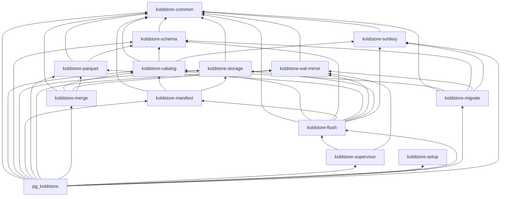

# Crate Architecture

pg-koldstore is organized as layered Rust crates. Library crates hold
PostgreSQL-free domain logic; [`crates/pg_koldstore`](../../crates/pg_koldstore)
is the thin integration shell (`pgrx`, SPI, hooks, custom scan FFI, background
worker entry points).

## Supervision Tree

The top-level operational hierarchy mirrors the runtime process model:

```text
koldstore-supervisor
├── flush
│   ├── manifest
│   ├── storage
│   └── parquet
└── wal  (koldstore-wal-mirror)
    ├── wal      — applier registry / identity / naming
    └── mirror   — __cl SQL, pgoutput, PK guards
```

- **Supervisor** owns PostgreSQL-free worker identity, generations, reservations,
  registration backoff, wait scheduling, and the semantic grouping of background
  services.
- **Flush** owns durable hot-to-cold workflow logic and exposes its lower storage
  stack as `flush::{manifest, storage, parquet}`.
- **WAL-mirror** (`koldstore-wal-mirror`, re-exported as `supervisor::wal`) owns
  the persistent applier lifecycle contract plus clean-schema mirror SQL/decode.
- **`pg_koldstore::worker`** remains the PostgreSQL adapter: static/dynamic worker
  registration, SPI transactions, latches, signals, shared-memory allocation,
  and process-liveness reconciliation.

This hierarchy does **not** move `pgrx` into library crates. The persistent WAL
applier and ephemeral maintenance/flush processes are PostgreSQL concepts and
therefore remain implemented in `pg_koldstore`.

## Extension Domains

| Domain | Library crate(s) | Extension adapter |
|---|---|---|
| Setup | `koldstore-setup` | `pg_koldstore` bootstrap SQL + SPI |
| Migrate | `koldstore-migrate` | `pg_koldstore::sql::migrate` |
| Merge scan | `koldstore-merge` | `pg_koldstore::merge_scan` — see [scanning-table.md](scanning-table.md) |
| WAL + mirror | `koldstore-wal-mirror` | `pg_koldstore::mirror`, `pg_koldstore::worker::wal` |
| Flush service | `koldstore-flush`, `koldstore-manifest` | `pg_koldstore::sql::flush`, flush executors |
| Supervision | `koldstore-supervisor` | `pg_koldstore::worker::supervisor` |
| Storage | `koldstore-storage`, `koldstore-parquet` | storage registration wrappers |
| Schema | `koldstore-schema` | schema registry SQL execution |

## Setup vs Schema vs Catalog

- **setup** (`koldstore-setup`): DDL plans for internal objects in
  `koldstore--0.1.0.sql` — `storage`, `schemas`, `manifest`, `jobs`,
  `cold_segments`, `cold_segment_index`, sequences, types, indexes, grants.
  Dependency-free leaf (parses/classifies SQL only).
- **schema** (`koldstore-schema`): `koldstore.schemas` registry — column sets,
  versions, type matrix, initialization state for migrated tables.
- **catalog** (`koldstore-catalog`): cold bookkeeping — segment visibility,
  sync-state FSM, managed-table snapshots, flush policy config, shared catalog
  reads, decode/cache. It must stay free of `koldstore-storage`.

**Do not merge schema and catalog.** Schema stays a leaf used by migrate and
Parquet; catalog depends on schema one-way for typed initialization state.

**Do not merge mirror and catalog.** Mirror owns `__cl` DML/DDL SQL and pgoutput
contracts. Catalog owns cold bookkeeping and may look up mirror identity, but it
does not build mirror upserts.

**Do not merge manifest and catalog.** Catalog is PostgreSQL cold-metadata
authority; `koldstore-manifest` owns the derived object-store export and depends
on catalog + storage.

## Dependency Graph



`koldstore-setup` is a dependency-free SQL classifier.
`koldstore-sortkey` is a foundation leaf with only a `koldstore-common` edge.
`koldstore-wal-mirror` is PostgreSQL-free and owns both the WAL-applier registry
and the mirror SQL/decode contracts (`wal` + `mirror` modules).
`koldstore-supervisor` is the highest PostgreSQL-free orchestration layer; it
contains no SPI, process, latch, or `pg_sys` code.

**Rules:**

1. Arrows point only into lower layers — no library crate depends on
   `pg_koldstore`.
2. `pgrx`, SPI, latches, shared-memory allocation, and worker entry points belong
   only in `pg_koldstore`.
3. New domain logic defaults to the lowest layer that can express it without
   PostgreSQL.
4. The persistent WAL service must not perform Parquet/object-store maintenance;
   it may only decode/apply mirror state and publish durable scheduling hints.
5. Heavy flush work must not execute inside the latency-sensitive WAL process.

## Where New Code Goes

| Change | Crate |
|---|---|
| Shared identifier, seq, row model, segment path layout | `koldstore-common` |
| Sort Key V1 encode/decode | `koldstore-sortkey` |
| Internal metadata table model | `koldstore-catalog` or `koldstore-schema` |
| Runtime column catalog | `koldstore-schema` |
| Internal table DDL plan | `koldstore-setup` |
| Object-store access and path templates | `koldstore-storage` |
| Parquet read/write | `koldstore-parquet` |
| Manifest model, assembly, and JSON I/O | `koldstore-manifest` |
| WAL applier registry + mirror SQL/pgoutput/PK guard | `koldstore-wal-mirror` |
| Hot+cold merge logic | `koldstore-merge` |
| Flush selection, encoding, segment publication, cleanup | `koldstore-flush` |
| Cross-service generations, reservations, backoff, and policy | `koldstore-supervisor` |
| Migration workflow | `koldstore-migrate` |
| SPI, hooks, custom scan, shared memory, worker main loops | `pg_koldstore` |

## Runtime Worker Model

```text
PostgreSQL postmaster
└── koldstore supervisor                  persistent, cluster-wide
    ├── koldstore WAL applier <db oid>    persistent, one per active DB
    │   └── WaitLatch → bounded apply → WaitLatch
    ├── koldstore maintenance <db oid>    ephemeral
    └── koldstore flush executor <db oid> bounded ephemeral pool
```

The WAL process holds no transaction, snapshot, apply lock, or slot ownership
while sleeping. Commit generations are coalesced; latches are latency hints;
the logical slot and `async_mirror_state` remain durable truth. The 30-second
`WaitLatch` timeout is recovery insurance, not the normal polling mechanism.
Fork, lifetime, and interval semantics are in
[jobs-and-scheduler.md](jobs-and-scheduler.md#process-lifecycle).

## Cleanup Policy

When moving code between crates:

- Remove dead functions, types, and imports with no remaining callers.
- Consolidate duplicate types to a single owner.
- Do not carry unused helpers "just in case".
- Narrow `pub` to `pub(crate)` unless another crate needs the item.
- Only delete provably unreferenced code; flag ambiguous cases in PR notes.

## Memory Longevity

Backend-local OID caches are entry-capped and invalidated on unmanage/flush.
Async apply and flush SPI paths page at fixed batch sizes. A persistent WAL
worker may retain only bounded lifecycle state and reusable buffers; per-drain
maps and decoded batches must be released before the worker returns to
`WaitLatch`.

Remaining billion-row follow-ups include segment cardinality until compaction,
streaming merge-scan emit, and incremental manifest publication.

## Documentation Standard

- Crate `lib.rs`: `//!` header — ownership, forbidden dependencies, and where new
  code goes.
- Module files: `//!` header — what logic the module implements.
- Logic-bearing functions: `///` with purpose, invariants, and `# Errors`.
- Extension SQL entrypoints: document user contract and delegating crate.

See [ADR-001](../decisions/001-layered-crate-architecture.md) for the original
layering rationale.

## Runtime Workflow Docs

- [manage-table.md](manage-table.md)
- [flushing-table.md](flushing-table.md)
- [scanning-table.md](scanning-table.md)
- [dml-table.md](dml-table.md)
- [mirror-capture.md](mirror-capture.md)
- [jobs-and-scheduler.md](jobs-and-scheduler.md)
