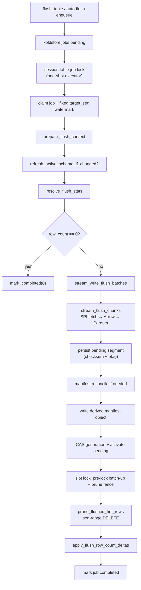

# Flush Table Workflow

This document describes the flush path after a durable job is claimed: how mirror
rows become Parquet segments, how the catalog and manifest are updated, and how
hot/mirror rows are pruned after a successful write.

**SQL entrypoint:** `koldstore.flush_table(table_name regclass) → jsonb`
**Default mode:** `koldstore.flush_execution = queue` — enqueue (or reuse) a job,
return the UUID immediately, and let a one-shot flush executor claim and run the
work. `inline` keeps encode/upload in the calling backend for SPI / `#[pg_test]`
only.
**Orchestrator:** `crates/pg_koldstore/src/sql/flush/execute.rs` (SPI + locks only)
**PG-free logic:** `crates/koldstore-flush/` (selection, encode, segment write, catalog plans),
`crates/koldstore-manifest/` (manifest assembly + JSON I/O), `crates/koldstore-parquet/`

Prefer `flush_table` as the public start path. `enqueue_flush_job` writes the
same durable job row without spawning executors. Row selection always follows
the table flush policy (`hot_row_limit` / `min_flush_rows` / `max_rows_per_file`).

All flushes are **table-wide** (`scope_key = ''` in catalog).

---

## Overview



Internal mirror/hot SQL runs under `with_custom_scan_disabled` so the flush path
does not recurse into `KoldMergeScan`.

### Apply lock vs Parquet (current contract)

`flush_table_with_session_lock` / the queue executor **do not** hold the
database apply (slot) lock during Parquet encode or object upload. The
background WAL applier keeps writing `__cl` while that work runs, so
`changes_since` can stay near real-time for new commits on other (and the same)
tables.

The slot/apply lock is acquired only inside finalize via try-lock + bounded
retry (`with_slot_lock_retry`, ~10s). That lock serializes **mirror apply vs
flush prune**, not heap DML: user `INSERT`/`UPDATE`/`DELETE`/`SELECT` on the
source table do not take it. Encode and object upload hold neither the slot
lock nor a table lock, so concurrent sessions keep committing under MVCC.

The WAL applier also try-locks. If finalize already holds the slot lock, the
applier yields and retries instead of blocking heap-unrelated apply behind a
re-taken lock. Per-tick GUC budgets are unchanged (`0` = drain the current
fence in one apply transaction).

The only source-table lock on the flush path is a **short** `SHARE ROW
EXCLUSIVE` during the prune fence after Parquet is already durable — in-flight
writers finish, new writers wait for that fence, ordinary `SELECT` continues.
See [mirror-capture.md](mirror-capture.md) and
[async-flush-prune-race](../cases/async-flush-prune-race.md).

Manual vs automatic: `auto_flush => false` disables scheduler-driven enqueue;
operators and tests still call `flush_table` when needed. Auto-flush is
KoldStore's own check interval + hot-row policy — not PostgreSQL autovacuum.
See [operations/scheduling.md](../operations/scheduling.md).

## Finalize — Async prune fence (after manifest publish)

After manifest publish and before `prune_flushed_hot_rows`:

1. Acquire the apply/slot lock (try-lock with bounded retry)
2. Bounded pre-lock catch-up so target-table sequences sit above `max_seq`
3. `LOCK TABLE ONLY … IN SHARE ROW EXCLUSIVE MODE` (local `lock_timeout`)
4. Capture durable WAL upper bound and run the prune fence apply
5. Existing atomic mirror+hot prune, then release locks with the transaction

Parquet upload stays concurrent with DML and background apply; only this short
finalize window serializes the slot.

---

## Phase 1 — Job lock and context

### 1.1 Advisory lock

Same transaction lock as manage: `lock_table_job(table_oid)`. Queue executors
claim this lock for the attempt; `flush_table` in queue mode releases it before
returning so the executor can take ownership.

### 1.2 Durable flush job

`jobs.rs` manages one active flush job per table:

| Step | Planner (`koldstore-flush/table_jobs.rs`) | Effect |
|------|------------------------------------------|--------|
| Lookup | `plan_lookup_active_inline_flush_job` | Reuse pending/running job |
| Insert | `plan_insert_inline_flush_job` | New UUID in payload |
| Running | `plan_mark_inline_flush_job_running` | |
| Completed / failed | `plan_mark_*` | Always returns job UUID to caller |

**Job lookup serde:** SQL returns `jsonb_build_object('id', …)::text` (and any
legacy payload fields) → durable job identity via `serde_json`.

### 1.3 Prepared context

`prepare_flush_context` resolves:

| Field | Source |
|-------|--------|
| `RelationContext` | namespace, table name |
| `FlushStorageContext` | `storage_type`, `base_path`, credentials/config, compression, schema version |
| `ManagedTableSnapshot` | mirror relation, PK columns |
| Catalog columns | `migration_catalog` |
| `indexed_columns` | PK ∪ catalog indexed columns (deduped) |
| `max_rows_per_file` | active flush policy + GUC floor |

### 1.4 Schema evolution gate

`refresh_active_schema_if_changed(table_oid)` — if the active schema version
changed, context is rebuilt. On error the job is marked failed and the UUID is
still returned.

---

## Phase 2 — Stats resolution (what to flush)

`resolve_flush_stats` (`spi.rs`) gathers SPI inputs, then delegates pure selection to
`koldstore-flush::stats::resolve_policy_flush_selection`.
It returns `ResolvedFlushSelection { stats: FlushStats, mirror_ops: Option<Vec<i16>> }`.

### Policy flush

1. **`mirror_pending_row_count`** — O(1) read from `koldstore.manifest.mirror_row_count`
   plus any same-backend pending apply/DML deltas (falls back to
   `mirror_flush_stats` if manifest missing)

2. Load **`FlushPolicy`** from `koldstore.schemas.options`:
   - SPI → `pgrx::JsonB` → `FlushPolicy::from_value`

3. **`policy_flush_row_count(pending, policy)`** — pure math:
   - If `pending ≤ hot_row_limit` → 0
   - Else flush `excess` in `min_flush_rows` chunks (with half-chunk partial rule)

4. **`mirror_oldest_rows_cutoff(table_oid, flush_count)`**:
   - `ORDER BY seq ASC LIMIT 1 OFFSET (N-1)` → `max_seq` cutoff
   - Returns `(selected_count, max_seq)`
   - Fallback if counters overshoot: live `mirror_flush_stats` + capped cutoff

Policy-path `FlushStats` uses `min_seq = 0`.

### Mirror stats serde (fallback paths)

```sql
SELECT jsonb_build_object(
  'row_count', count(*),
  'min_seq', COALESCE(min("seq"), 0),
  'max_seq', COALESCE(max("seq"), 0),
  ...
)::text
```

Rust: `serde_json::from_str` → `MirrorSeqStats` → `FlushStats`.

---

## Phase 3 — Early exit

If `selection.stats.row_count == 0`:

- `mark_flush_job_completed(0, 0, 0)`
- No Parquet, no cleanup, no manifest file write

---

## Phase 4 — Streaming encode and segment write

`stream_write_flush_batches` (`execute.rs`).

### 4.1 Setup

- Manifest paths: thin root `{base_path}/{namespace}/{table}/manifest.json` plus
  per-folder content-addressed shard files (see export shape below)
- Open the configured filesystem/S3 client and load the existing manifest object, or create a new shared manifest
- `next_flush_batch_number` from `koldstore.cold_segments`
- Build `StreamEncodeInput` (columns, Parquet schema, `max_seq`, optional `mirror_ops`)

### 4.2 Mirror fetch (SPI → typed rows)

**SQL planner:** `plan_mirror_flush_selection_batch` (`koldstore-flush/ops.rs`)

```sql
SELECT <app cols from hot/mirror join>,
       mirror."seq", mirror."op", (mirror."op" = 3) AS deleted
FROM koldstore.<schema>_<table>__cl AS mirror
LEFT JOIN ONLY {schema}.{table} AS hot ON <pk join>
WHERE mirror."seq" <= $1          -- max_seq cutoff
  AND mirror."seq" > $2           -- keyset lower bound
ORDER BY mirror."seq" ASC
LIMIT $3                          -- 8192 rows per SPI round trip
```

**Fetcher:** `mirror_fetch.rs::fetch_mirror_batch`

**SPI decode → `FlushMirrorRow`** (ordinal access, no per-column name lookup):

| PG type | `FlushColumnValue` |
|---------|-------------------|
| bool | `Bool` |
| int2/4/8 | `Int16` / `Int32` / `Int64` |
| float4/8 | `Float32` / `Float64` |
| text, numeric, bytea, text[] | `Utf8(String)` |
| uuid | `Utf8(uuid string)` |
| jsonb | `Utf8` (string or `serde_json::to_string`) |
| timestamptz | `TimestamptzMicros` (PG epoch µs + Unix offset; no string parse) |

Column layout: ordinals `1..N` = catalog columns, `N+1` = `seq`, `N+2` = `op`.

Non-PK column values for live rows come from the hot heap join. Delete mirror
rows (`op = 3`) carry PK values from mirror only.

### 4.3 Arrow encode

`stream_flush_chunks` (`koldstore-flush/encode.rs`):

1. Fetch page of up to 4096 rows (`FLUSH_MIRROR_FETCH_BATCH_SIZE`), clamped by
   `max_rows_per_file`
2. Optionally buffer and sort by configured segment-order column → PK → `seq`
3. `CleanColdRecordBatchBuilder::push_typed_row` per row (app columns +
   metadata: `seq`, `op`, `deleted`, `schema_version`)
4. Write Parquet with native `sorting_columns` metadata (`seq` ascending always;
   plus the order-key / PK leaves when segment-order sort ran) via
   `WriterPropertiesBuilder::set_sorting_columns` — rows are already sorted;
   the footer only declares that layout
5. When a chunk reaches `max_rows_per_file` / byte target → `FlushWriteChunk`
   callback writes the Parquet segment

**No per-row cleanup JSON** is built in the encode loop; prune uses
`plan_seq_range_cleanup` (`seq <= max_seq`).

Finalization retains the `ParquetMetaData` returned by `ArrowWriter::close()`.
Catalog scalar bounds, aligned row-group arrays, row counts, null counts, and
SeqId ranges are derived from that metadata and encoded directly as Sort Key V1
bytes. There is no manual per-cell `indexed_bounds` path. Details:
[ADR-002: Footer-Derived Catalog Segment Stats](../decisions/002-footer-derived-catalog-stats.md).

### Memory bounds

Flush peak RSS is **O(`max_rows_per_file`)**, not O(rows flushed). SPI pages
(≤4096), Arrow row groups (1024), and apply batches (8192) are capped; the open
compressed Parquet buffer for the current segment is the dominant spike until
upload completes and the chunk is dropped. Idle Docker RSS after a heavy flush
is usually PostgreSQL `shared_buffers` (often 128 MB), not retained flush of the
full table. Operator guidance for small machines:
[Memory and small machines](../performance.md#memory-and-small-machines).

### 4.4 Parquet write

`write_flush_segment_with_client` (`segment_write.rs`):

1. Path: `{namespace}/{table}/{folder:03}/segment-{NNNN}-{token}.parquet`
   (100 segments per folder; `token` is 8 hex chars from the catalog
   `segment_id` so a retry after abort cannot collide with an orphaned final at
   the same `batch_number`). Manifest stores the table-relative form
   `{folder:03}/segment-{NNNN}-{token}.parquet`. One layout for all tables
   (no per-scope object prefixes).
2. Encode in memory and close `ArrowWriter`, returning final bytes plus the
   exact in-memory footer metadata. Write validation checks the Parquet
   envelope and that metadata without reopening the footer.
3. Durable publish through `koldstore-storage`:
   - temp key under `{prefix}/.tmp/…` (flat file; UUID in the name — no
     per-attempt subdirectories that would linger empty after cleanup)
   - `PutMode::Create` / `copy_if_not_exists` to the final key
   - size validation; never truncate a final key in place
   - filesystem backends use `LocalFileSystem::with_fsync(true)`
4. Writer properties:
   - Column statistics on `seq` + PK + indexed columns
   - Bloom filters on PK columns (`max_ndv` = row-group size)
   - Compression from storage context (default `zstd`)
5. Sort Key V1 rows for `cold_segment_index` come directly from footer
   statistics. Each row stores scalar segment min/max and aligned
   `row_group_min_values`, `row_group_max_values`, and
   `row_group_null_counts` arrays.
6. `byte_size` from published object metadata (not recomputed by scanning rows)
7. Assemble `ManifestSegment`s from catalog rows (+ index bounds) once, then `manifest.append_segment_batch(...)`
8. Collect `WrittenFlushSegment` (new `segment_id = Uuid::new_v4()`)

Manifest finalize publishes immutable content-addressed shard objects, then
atomically overwrites the thin root.
Changed shards are published before the root; completed folders whose content hash
is unchanged are not rewritten. Each root reference carries the shard SHA-256 so a
crash or external mutation is detected instead of silently merging inconsistent JSON.

### 4.5 Validation

`validate_flush_row_selection(stats.row_count, rows_written)` — counts must match.

---

## Phase 5 — Catalog insert as `pending` (per segment)

During streaming, each Parquet file is cataloged immediately via
`persist_flush_segment` with **`status = 'pending'`** (not query-visible):

1. One SPI insert for `koldstore.cold_segments` + `cold_segment_index`
   (native arrays / `unnest`), including `checksum` (sha256 hex) and
   `object_etag` from the single publish pass
2. No per-PK catalog rows — prune with Sort Key V1 `cold_segment_index` /
   Parquet row-group stats and bloom filters so catalog size stays O(segments ×
   indexed columns)

`column_stats` in object-store `manifest.json` is derived at export time from
`koldstore.cold_segment_index` (Sort Key V1 bounds). Query-path prune uses the
same index table directly; `cold_segments` no longer stores a duplicated JSON
copy.
Failpoints: `after_checksum_metadata` then
`after_pending_segment` after the pending insert.

---

## Phase 6 — Seq-range cleanup (after activate)

`prune_flushed_hot_rows` (`spi.rs`) — **production path uses seq-range DELETE,
not JSON cleanup**. Runs only after pending segments are activated.

`plan_seq_range_cleanup` (`cleanup.rs`):

```sql
WITH removed_mirror AS (
  DELETE FROM koldstore.<schema>_<table>__cl AS mirror
  WHERE mirror."seq" <= $1 [AND mirror."op" = …]
  RETURNING <pk cols>, seq, op
),
deleted_hot AS (
  DELETE FROM ONLY {schema}.{table} AS hot
  USING removed_mirror
  WHERE removed_mirror."op" IN (1, 2)
    AND <pk join>
  RETURNING 1
)
SELECT count(removed_mirror), count(deleted_hot)
```

- Bind parameter: single `bigint max_seq`
- Runs under `SET LOCAL session_replication_role = replica` so source triggers
  do not capture KoldStore's own pruning
- The hot DELETE runs with PostgreSQL's session replication origin set to the
  named origin `koldstore_flush` for the remainder of the flush transaction
  (restored after commit/abort). pgoutput emits ORIGIN from the commit
  record's origin, so clearing the origin before commit left PG15 streams with
  prune DELETEs but no ORIGIN name for apply to skip.
- Mirror rows removed first; hot rows removed only for `op IN (1,2)` (insert/update)
- Delete tombstones (`op = 3`) stay in cold after flush; mirror copy is removed

`koldstore_flush` matters during mirror capture: pruning hot source rows is KoldStore
maintenance, not application DML, and must not be decoded later into fresh
tombstones. On PG16+ peek uses `origin=none` as defense in depth; on PG15
(no that filter) apply skips ORIGIN-stamped prune transactions by name.
Replication-origin marking uses `replorigin_session_setup` / `reset` via the
backend C API (not SQL `pg_replication_origin_session_setup`, which is awkward
mid-flush); the origin stays armed through COMMIT so pgoutput emits ORIGIN,
then a xact callback restores the prior session state. The trigger-control
setting above remains transaction-local SQL state.

Production prune uses `plan_seq_range_cleanup` (`seq <= max_seq`); the JSON
`jsonb_to_recordset` cleanup planner was removed.

---

## Phase 7 — Manifest counter deltas (after cleanup)

`apply_flush_row_count_deltas` → `koldstore.internal_apply_flush_row_counts`:

```sql
UPDATE koldstore.manifest SET
  mirror_row_count = GREATEST(0, mirror_row_count - mirror_pruned),
  hot_row_count    = GREATEST(0, hot_row_count - hot_pruned),
  cold_row_count   = GREATEST(0, cold_row_count + cold_rows_added)
WHERE table_oid = $1 AND scope_key = ''
```

Four native `bigint` SPI parameters — no JSON.

---

## Phase 8 — Manifest reconciliation

If in-memory `manifest.segments.len() != publishable_cold_segment_count`
(`pending` + `active`):

- Rebuild from catalog: `plan_publishable_cold_segments_for_manifest_json`
- SQL → `jsonb_agg` text → `Vec<CatalogManifestSegmentRow>` → `Manifest`

Guards against drift between streamed manifest and catalog truth before activate.

---

## Phase 9 — Finalize (derived manifest + CAS activate)

| Step | Serde |
|------|-------|
| Write object manifest | sharded root + folder shards via `serde_json` |
| CAS activate | `plan_activate_flush_segments`: bump `manifest.generation` bigint where expected matches; set pending → `active` for this flush’s segment ids |
| Complete job | native SPI bigints |
| Invalidate cache | `catalog::cache::invalidate_table` |

The durable ordering is: publish final segments → insert **pending** catalog rows
→ write derived manifest object → **CAS generation + activate** → prune
mirror/hot rows → apply row count deltas → mark the job complete. Cleanup never
runs before activate succeeds, so a CAS/manifest failure leaves hot data
authoritative and retryable. Pending segments are invisible to merge scan
(`status = 'active'` only).

See [ADR-004](../decisions/004-segment-publication-protocol.md).

### Object-store manifest export shape (`koldstore-manifest`)

Folder-sharded layout only (manifest version `2`):

- Root `{namespace}/{table}/manifest.json`: watermarks (`max_seq`),
  schema/publish metadata, `files` folder counters, and
  `shards[]` (`folder`, `path`, `content_sha256`, segment/seq ranges). No
  embedded segment bodies.
- Shard `{folder:03}/manifest-shard-{sha256-prefix}.json`: that folder’s
  `segments[]` with segment identity/path/status/checksum, scalar ranges,
  row-group arrays, and per-column hex Sort Key V1 segment/row-group bounds
  mirroring PostgreSQL. The filename retains 128 hash bits; the root stores and
  readers verify the complete SHA-256. After the new root is published,
  unreferenced shard versions are removed while segment objects are preserved.

PostgreSQL catalog remains query authority; object manifests are derived export
only.

After finalize, `sync_state` becomes `in_sync` and `generation` is monotonic.

---

## Serde boundary summary

| Boundary | Format |
|----------|--------|
| Job lookup | JSON text `{id, …}` |
| Flush policy | `JsonB` → `FlushPolicy` |
| Manifest counters | JSON text `{hot_row_count, mirror_row_count, …}` |
| Mirror stats (fallback) | JSON text → `MirrorSeqStats` |
| Mirror row fetch | SPI heap tuples → `FlushMirrorRow` (typed, no JSON) |
| Arrow / Parquet | `FlushColumnValue` → Arrow builders → binary Parquet |
| Segment catalog insert | native PG arrays + `jsonb[]` stats |
| Cleanup | single `bigint max_seq` |
| Counter deltas | 4× `bigint` |
| Manifest file | `serde_json` bytes |

---

## Key constants

| Constant | Value | Location |
|----------|-------|----------|
| Mirror fetch batch | 8192 | `FLUSH_MIRROR_FETCH_BATCH_SIZE` |
| Scope | `scope_key = ''` | all flush SQL |

---

## Crate map

| Concern | Location |
|---------|----------|
| Orchestration | `pg_koldstore/src/sql/flush/execute.rs` |
| Stats, cleanup, catalog SPI | `pg_koldstore/src/sql/flush/spi.rs` |
| Mirror fetch/decode | `pg_koldstore/src/sql/flush/mirror_fetch.rs` |
| Encode loop | `koldstore-flush/src/encode.rs` |
| Mirror selection SQL | `koldstore-flush/src/ops.rs` |
| Seq-range cleanup | `koldstore-flush/src/cleanup.rs` |
| Parquet write | `koldstore-parquet/src/writer.rs`, `batch_builder.rs` |
| Manifest model | `koldstore-manifest/src/model/` |
