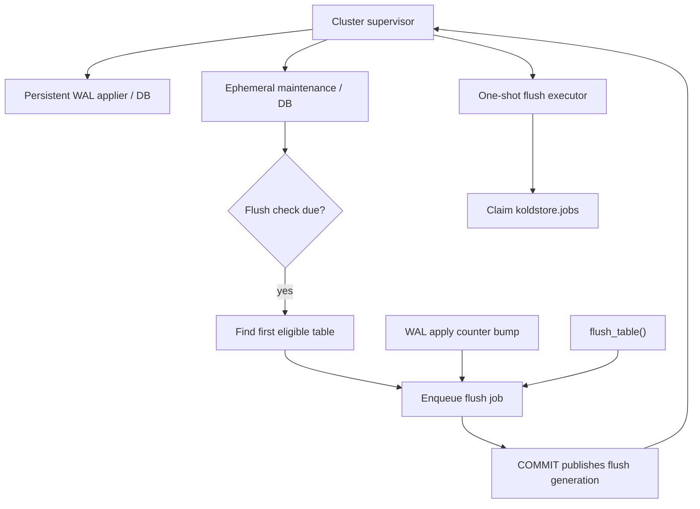

# Jobs and Scheduler

KoldStore uses durable rows in `koldstore.jobs` as a PostgreSQL-native flush
queue. Scheduling and recovery run in an ephemeral per-database maintenance
worker; Parquet work runs in bounded one-shot flush executors. Persistent WAL
application is a separate latch-driven service and is not part of the flush
scheduler loop. Jobs are both the work request and the operator-visible
progress record.

Production default is `koldstore.flush_execution = queue`.
`koldstore.flush_execution = inline` exists only so `#[pg_test]` SPI
transactions can run flush in the calling backend.

## Runtime topology

Only the supervisor registers child workers. See [Process lifecycle](#process-lifecycle)
for fork, lifetime, and the 30-second intervals. WAL apply details are in
[mirror-capture.md](mirror-capture.md). A registration backoff applies when
`max_worker_processes` is exhausted.

## Process lifecycle

These are PostgreSQL **background workers**. The postmaster forks a full backend
(own PID, `pg_stat_activity.backend_type`). They are not threads inside another
process. The supervisor is registered at `shared_preload_libraries` load.
Children are dynamic (`load_dynamic`) with `BGW_NEVER_RESTART`; the supervisor
re-registers a still-required service.

| Process | `backend_type` | Lifetime | Work |
| --- | --- | --- | --- |
| Cluster supervisor | `koldstore supervisor` | Persistent (postmaster restart 1 s). Connects to `postgres`. | One per cluster. Dispatches from **shared-memory** generations and deadlines. Does not poll `koldstore.jobs` and does not decode WAL. Cluster cap of 8 concurrent flush executors. |
| WAL applier | `koldstore wal applier <db oid>` | Persistent while the database owns a KoldStore logical slot | One per active database. Sleeps on `WaitLatch`; managed-commit `SetLatch` is the normal wake. Logical-decodes pgoutput from the database slot into `__cl`, then sleeps. Soft apply errors back off in-process (100 ms … 5 s). No Parquet or object-store I/O. |
| Maintenance | `koldstore maintenance <db oid>` | Ephemeral: 200 ms idle grace, then exit. At most one per database. | Orphan-job reclaim, auto-flush reconciliation, flush-queue hints. Does not encode Parquet. |
| Flush executor | `koldstore flush executor <db oid>` | One-shot: claim one job, run it, exit | Started only when the supervisor sees a dirty flush-queue generation **and** capacity remains (`koldstore.max_parallel_flush_jobs` per database). |

Client backends (`flush_table`, `enqueue_flush_job`) never call
`RegisterBackgroundWorker`. They write a durable job and a transaction-local
dirty bit; COMMIT publishes a generation; the supervisor registers the child.

### How a flush job becomes a process

1. A `pending` row lands in `koldstore.jobs` and the backend marks the flush
   queue dirty. Sources: `flush_table`, `enqueue_flush_job`, WAL-apply policy
   evaluation on a counter bump (`schedule_policy_after_counter`), or a
   maintenance scheduler tick.
2. COMMIT publishes the generation. The supervisor does **not** discover work by
   querying `jobs`.
3. If running/starting executors are below the per-database limit and the
   cluster cap of 8, the supervisor registers a dynamic worker and the
   postmaster forks it.
4. That process pages pending jobs (16 at a time), try-locks one table, claims
   the job, runs [flushing-table.md](flushing-table.md), then exits.
5. No claimable job → the process exits without Parquet work. Locked candidates
   schedule a 200 ms retry deadline rather than spinning.

No pending flush work means **no flush executor is forked**.

### What the 30-second intervals are

| Interval | Owner | Meaning |
| --- | --- | --- |
| `koldstore.flush_check_interval_seconds` (default 30) | Maintenance | When this deadline fires, the supervisor starts one ephemeral maintenance backend. That process evaluates auto-flush candidates (up to 64 tables; enqueues at most one job). It is **not** “fork a flush executor every 30 s.” If nothing is due, maintenance exits and no executor is created. |
| WAL `WaitLatch` timeout (30 s, `WAL_APPLIER_WATCHDOG` in `wal.rs`) | WAL applier | Safety recovery if a commit latch is missed (including two-phase commit). **Not** the normal apply poll. The applier holds no transaction while waiting. Managed commits `SetLatch` immediately. |
| Supervisor safety reconcile (30 s) | Supervisor | Reconciles slot/worker liveness when the cluster has KoldStore slots. |

The usual auto-flush enqueue does **not** wait for the maintenance interval:
after a WAL apply counter bump, the apply transaction evaluates that table and
may enqueue immediately. Maintenance is the reconciliation / RowLimit cadence
for tables that were not just applied, plus orphan recovery.

Idle WAL apply is latch-driven logical decoding of the database slot, not a
continuous tail of WAL files. See [mirror-capture.md](mirror-capture.md).

## `koldstore.jobs`

Each job has an ID, table OID, table-wide empty `scope_key`, type, status,
phase, payload, progress fields, timestamps, and optional cancellation/error
metadata. Current job types are `migrate_backfill` and `flush`. Flush jobs move
through `pending` → `running` → a terminal `completed`, `error`, or `cancelled`
state. The flush path records `rows_processed`, `rows_flushed`, batches,
checkpoint sequence, duration, and phase as it progresses.

The extension permits one active (`pending` or `running`) flush job per table.
In queue mode, `flush_table` enqueues (or reuses) that job and returns its UUID
immediately; a one-shot executor claims the **table** job lock and runs the
work. The database **apply/slot** lock is not held for the whole flush: Parquet
upload runs alongside background mirror apply; finalize try-locks the slot only
for the short catch-up + prune fence. See [flushing-table.md](flushing-table.md)
and [mirror-capture.md](mirror-capture.md).

Useful SQL entry points:

| Entry point | Purpose |
| --- | --- |
| `koldstore.flush_table(table)` | Enqueue or reuse the active flush job; COMMIT publishes a flush-queue generation so the supervisor can register a one-shot executor. Returns jsonb (`job_id`, `status`, `error`, …). |
| `koldstore.enqueue_flush_job(table)` | Same durable enqueue/lookup. Does not register a worker from this backend; COMMIT still publishes the queue generation. |
| `koldstore.list_jobs(statuses, job_types, table)` | Read job status and progress as JSON. |
| `koldstore.cancel_job(id)` | Request cooperative cancellation of one active job. |
| `koldstore.cancel_table_jobs(table)` | Cancel pending work and request cancellation of running work for a table. |

Cancellation is cooperative: the running flush polls the durable request at
safe boundaries. Drop and unmanage hard-cancel pending jobs and signal running
ones. Startup/scheduler recovery reclaims a durable `running` flush only after
it can acquire that table's job lock, which proves no live owner holds it.

## Maintenance and WAL loops

See [Process lifecycle](#process-lifecycle) for fork, PID, and interval
semantics. This section is the wake contract.

Managed commits advance a shared WAL generation and set the persistent WAL
applier latch (with the cluster supervisor as lifecycle fallback). Concurrent
commits coalesce into one bounded WAL drain. Soft SPI/apply errors stay in the
WAL process with bounded exponential backoff rather than permanently ending the
applier; hard process death is recovered by the supervisor even when the mirror
is already caught up. The 30-second `WaitLatch` timeout recovers missed
in-memory hints without opening an idle apply transaction.

Flush scheduling is independent of the apply wake. WAL apply may enqueue a flush
job in the same transaction that bumped a table's mirror counters. Ephemeral
maintenance runs when recovery or a scheduled deadline is due, scans auto-flush
candidates, and enqueues at most one auto-flush job per tick. Remaining due
tables publish another maintenance generation. Pending jobs wake the supervisor,
which registers executors up to `koldstore.max_parallel_flush_jobs`.

Auto-flush eligibility is **not** driven by PostgreSQL autovacuum. It uses
KoldStore mirror / hot-row policy. See
[operations/scheduling.md](../operations/scheduling.md).

## Automatic flush selection

A table is eligible only when it is active, has an enabled flush policy, and
has not opted out with `auto_flush = false`. Candidate selection excludes a
table with a running flush and delays a table for 60 seconds after a failed
flush. Candidates are ordered by newest managed table first. A tick scans up
to 64 tables and enqueues at most one due job; remaining due tables publish
another maintenance generation.

- `row_limit` policies use the manifest mirror-row counter plus pending local
  counter deltas and flush only the policy-selected excess.
- `older_than` policies resolve eligible mirror rows through the flush stats
  path.
- A busy table is skipped without waiting; a later check can choose it again.
- Manual `flush_table` / `enqueue_flush_job` ignore the automatic-flush
  opt-out, so operators can flush an opted-out table deliberately.

The internal `koldstore.internal_run_flush_scheduler_tick()` exists for tests
and diagnostics. Production scheduling comes from ephemeral maintenance workers
started by the cluster supervisor.

## Operational knobs

| Setting | Effect |
| --- | --- |
| `koldstore.async_apply_watchdog_interval_ms` | Registered GUC (default `30000`). Managed commits `SetLatch` immediately. The applier's idle wait is currently the hardcoded 30 s `WAL_APPLIER_WATCHDOG` in `wal.rs`, not this GUC. |
| `koldstore.async_apply_max_rows_per_tick` / `...max_ms_per_tick` | Bound one apply transaction. |
| `koldstore.flush_check_interval_seconds` | Cadence for ephemeral maintenance auto-flush reconciliation (default 30). Does not by itself start a flush executor. |
| `koldstore.max_parallel_flush_jobs` | Cap on concurrent one-shot flush executors per database (cluster cap 8). |
| `koldstore.flush_execution` | `queue` (default) or `inline` (SPI tests only). |
| `koldstore.job_retention_days` | Days to retain terminal jobs before purge (`0` disables). |
| `auto_flush` table option | Enables or opts a table out of background flushes. |
| Flush policy | Defines row-limit or age-based eligibility and the amount selected. |

See [mirror capture](mirror-capture.md) for apply correctness and
[flushing](flushing-table.md) for the flush lifecycle after a job is claimed.
