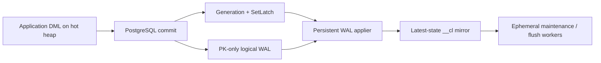

# Mirror Capture

KoldStore keeps a latest-state change-log mirror for every managed table. The
application continues to issue ordinary PostgreSQL `INSERT`, `UPDATE`, and
`DELETE` statements against the hot heap; committed WAL is then applied to the
mirror by a persistent database-scoped WAL applier. The mirror is not an event
log and foreground DML never writes it directly.



## Contract

| Property | Behavior |
| --- | --- |
| Capture source | Committed WAL from one database-scoped logical slot |
| Foreground transaction | Commits after the heap write; mirror application follows asynchronously |
| Normal latency path | Top-level commit publishes one coalesced generation and sets the applier latch |
| Idle behavior | Applier holds no transaction, snapshot, apply lock, or slot ownership while sleeping |
| Exact mirror boundary | `SELECT koldstore.wait_for_async_mirror()` |
| Rollback | Aborted transactions never reach logical decoding |
| Publication payload | Primary-key columns plus the optional immutable order column; other values remain in the hot heap |
| Ordering | `seq` is allocated on apply and is used for mirror/flush ordering, not as a commit-order cursor |

`wal_level=logical` is required. `manage_table` provisions the shared
publication and deterministic database slot when needed, records that the
database requires a WAL service, and refuses to manage a table when logical
decoding is unavailable.

## Worker topology

```text
koldstore supervisor                         persistent, one per cluster
├── koldstore WAL applier <database oid>     persistent, one per active DB
│   └── WaitLatch → bounded apply → WaitLatch
├── koldstore maintenance <database oid>     ephemeral
└── koldstore flush executor <database oid>  bounded ephemeral pool
```

Each line is a postmaster-forked PostgreSQL backend (own PID), not a thread.
Lifetimes, dispatch, and the 30-second intervals are in
[jobs and scheduler — Process lifecycle](jobs-and-scheduler.md#process-lifecycle).

WAL application is a latency-sensitive service. Scheduled maintenance, policy
reconciliation, Parquet encoding, and object-store I/O are jobs and remain
outside the always-on applier.

The applier is registered dynamically, so a PostgreSQL worker slot is consumed
only for databases that own KoldStore async-capture infrastructure. It is one
worker per database—not one worker per table, scope, tenant, or subscription.

## Activation without a gap

For an existing table, `manage_table` creates the mirror and PK-update guard,
then holds the database apply lock while it adds the relation's published
columns and records an activation LSN. It backfills the heap into the mirror,
catches up committed WAL above the backfill sequence floor, then marks the
schema active. Concurrent writes land in WAL during the backfill, so they are
included by catch-up. Empty tables activate through the same publication and
worker setup without a backfill.

Activation marks the database WAL service as required and publishes a
commit-aware generation. Consequently, the applier is already resident before
the first later application write; process creation is not part of steady-state
commit latency.

The only source-table trigger is a `BEFORE UPDATE OF <pk>` guard. It rejects a
real primary-key mutation because the mirror key is the identity used by flush
and merge; `SET id = id` is allowed. There are no DML capture triggers.

## Commit wake path

Managed-table statements mark backend-local transaction state dirty. Only a
successful top-level commit publishes work:

```text
managed DML
  ↓
ExecutorEnd marks transaction dirty
  ↓
COMMIT callback publishes wal_generation
  ↓
SetLatch(persistent WAL applier)
  ↓
SetLatch(cluster supervisor) as lifecycle fallback
```

Multiple rows and statements in one transaction collapse to one wake. Concurrent
commits may also coalesce while the applier drains; the monotonically increasing
generation ensures another pass runs when a commit arrived during the previous
fixed fence.

Latches are latency hints. The logical slot, durable `applied_lsn`, and shared
generations are authoritative, so a stale PID or missed latch cannot lose work.
A 30-second watchdog covers two-phase commits and unexpected missed hints; it is
not the normal polling interval and does not open an idle transaction.

## Apply and recovery

The applier reads bounded pgoutput batches, groups them by relation and
operation, and applies typed PK arrays with set-based SQL. Inserts and deletes
are idempotent `ON CONFLICT` writes; updates use a keyed update plus an
insert-missing fallback. A batch, its row-counter delta, policy hints, and its
durable `applied_lsn` checkpoint commit together. The slot advances to a
checkpoint only on a later pass, making replay after a crash safe.

Sequence allocation is always above the durable high watermark and any flush
prune floor. This prevents a post-restart or concurrent flush apply from
reusing a sequence range that was already published to cold storage.

If the WAL process exits, the postmaster lifecycle signal wakes the static
supervisor. PostgreSQL's process list is reconciled with shared state; stale
STARTING/PID values are cleared and a required service is registered again even
when the database was already caught up. Registration pressure uses bounded
backoff rather than spinning.

`koldstore.async_mirror_status()` separates the services:

```json
{
  "wal_applier": {
    "required": true,
    "pid": 1234,
    "running": true,
    "starting": false,
    "pending": false,
    "wal_generation": 42,
    "wal_processed_generation": 42
  },
  "maintenance": {
    "pid": null,
    "running": false,
    "maintenance_generation": 7,
    "maintenance_processed_generation": 7
  }
}
```

The retained-WAL threshold is an operational health signal; it does not stop
application of WAL, because applying is the recovery action.
`koldstore.disable_async_mirror()` refuses cleanup while an active table still
depends on capture, disables WAL-service restarts, terminates the process, then
removes the slot/publication. A teardown failure restores the service
requirement so a surviving slot is never abandoned.

## Consistency boundaries

- A normal heap query sees its committed write immediately.
- `koldstore.changes_since` and merge scans that need latest-state overlays read
  the mirror (and cold), **not** the heap. A committed heap mutation is visible
  there only after WAL apply has written `__cl`.
- Call `wait_for_async_mirror()` before a read that requires an exact catch-up
  boundary. Background apply is normally latch-driven and sub-second; the fence
  covers committed WAL through a captured boundary. It cannot observe the
  caller's uncommitted changes or advance a snapshot acquired before the call.
- Automatic flush is optional (`auto_flush`). Latency-sensitive change-feed
  consumers often manage tables with `auto_flush => false` and call
  `flush_table` deliberately so finalize windows are predictable. Auto-flush
  enqueues durable jobs on KoldStore's check interval; it is not PostgreSQL
  autovacuum.

## Flush concurrency (apply stays live during Parquet)

One database has **one** logical slot and **one** apply advisory lock. Flush
finalization and the WAL applier therefore cannot decode/apply the same slot at
the same time. That does **not** mean flush pauses mirror apply for the whole
job.

| Flush phase | Apply lock / slot | Persistent WAL applier | Typical `changes_since` lag |
| --- | --- | --- | --- |
| Select + Parquet encode/upload | **Not held** | Continues on commit latch wakes | Sub-second under normal load |
| Finalize (pre-lock catch-up + prune fence) | **Held briefly** | Waits for unlock | Pauses only for that short window |
| After job completes | Free | Continues | Sub-second again |

Rationale: prune deletes `mirror WHERE seq <= max_seq` then matching hot rows by
PK. Concurrent apply into those keys during prune can drop a newer hot version
while cold keeps an older image (see
[async-flush-prune-race](../cases/async-flush-prune-race.md)). Exclusive apply
during the short finalize window closes that race. The expensive object-store
work stays concurrent with DML and mirror apply.

## Resource model

While idle, the WAL process is blocked in `WaitLatch` and consumes effectively
no application CPU. Its persistent cost is one PostgreSQL process/worker slot
and bounded process memory. Per-drain decoded batches and maps must be released
before returning to the latch; the worker must not retain an open transaction,
MVCC snapshot, object-store client, or Parquet payload between wakes.

See [crate architecture](crate-architecture.md), [DML](dml-table.md),
[jobs and scheduler](jobs-and-scheduler.md), and [flushing](flushing-table.md)
for the surrounding layers.
